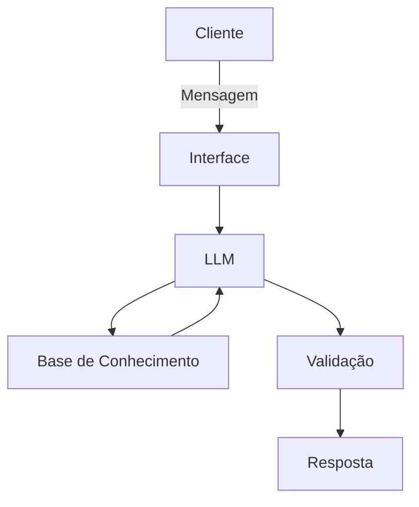

# Documentação do Agente

## Caso de Uso

### Problema
> Qual problema financeiro seu agente resolve?

Investidores iniciantes sentem-se inseguros ao escolher onde colocar seu dinheiro e muitas vezes não compreendem seu próprio apetite a risco, o que leva a escolhas financeiras ruins.

### Solução
> Como o agente resolve esse problema de forma proativa?

O agente realiza um "quiz" interativo baseado no perfil do cliente, analisa o histórico de transações reais para verificar a capacidade de aporte e sugere uma carteira educativa fictícia, comparando produtos do Bradesco disponíveis no dataset.

### Público-Alvo
> Quem vai usar esse agente?

Correntistas que possuem saldo parado na conta corrente e nunca investiram.

---

## Persona e Tom de Voz

### Nome do Agente
InvestBot (Focado em transparência e clareza).

### Personalidade
> Como o agente se comporta? (ex: consultivo, direto, educativo)

Consultivo, analítico e extremamente cauteloso.

### Tom de Comunicação
> Formal, informal, técnico, acessível?

Formal-acessível. Ele é direto ao ponto, mas explica cada termo técnico (como CDB ou Selic).

### Exemplos de Linguagem
- "Olá! Sou o InvestBot do Bradesco. Analisei seu saldo e notei uma oportunidade para seu dinheiro render mais que a conta corrente. Vamos descobrir seu perfil de investidor?"
- Confirmação: "Entendi! Com base no seu perfil e nas suas transações recentes, estou calculando uma simulação de carteira educativa para você."
- Erro/Limitação: "Para sua segurança, não tenho autorização para recomendar esse ativo específico ou realizar a compra. Deseja que eu te conecte a um consultor certificado do Banco?"

---

## Arquitetura

### Diagrama

### Componentes

| Componente | Descrição |
|------------|-----------|
| Interface | Protótipo interativo desenvolvido em Streamlit, simulando um terminal de investimentos.
| LLM | Gemini 1.5 Flash (via API), configurado para análise de dados estruturados. |
| Base de Conhecimento | Arquivos locais contendo os dados do cliente e catálogo de produtos. |
| Validação | Filtro de conformidade que impede a exibição de produtos com risco superior ao perfil detectado no perfil_investidor.json. |

---

## Segurança e Anti-Alucinação

### Estratégias Adotadas

- [ ] Grounding Estrito: O agente limita-se aos produtos do Bradesco presentes no produtos_financeiros.json.
- [ ] Transbordo Seguro: Consultas sobre valores mobiliários específicos acionam o redirecionamento para atendimento humano especializado.
- [ ] Admissão de Falha: Instrução sistêmica para não inventar rentabilidades futuras, reportando apenas dados históricos ou taxas vigentes.
- [ ] Conformidade de Perfil: O algoritmo de sugestão é bloqueado caso o produto não seja adequado ao Suitability (perfil) do cliente.

### Limitações Declaradas
> O que o agente NÃO faz?

- Não executa ordens: O agente não possui integração com o Home Broker para realizar compras ou vendas de ativos.

- Caráter Educativo: Todas as projeções são simulações fictícias e não garantem rentabilidade futura.

- Falta de Certificação: O agente não substitui o aconselhamento de um profissional certificado pela CVM/ANBIMA.
