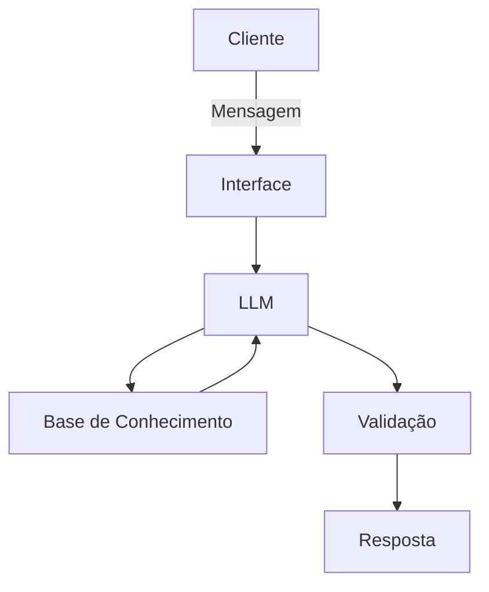

# Documentação do Agente

## Caso de Uso

### Problema
> Qual problema financeiro seu agente resolve?

Inúmeras mulheres empreendedoras brasileiras, especialmente em contextos periféricos, enfrentam uma jornada dupla árdua e sentem que o sistema financeiro é nebuloso e não foi concebido para suas necessidades específicas. A linguagem técnica e a falta de oportunidades concretas geram uma lacuna de informação que dificulta a prosperidade de seus negócios.

### Solução
> Como o agente resolve esse problema de forma proativa?

A Luma resolve esse problema atuando como uma mentora financeira proativa. Ela não apenas responde perguntas, mas utiliza os dados de transações e o perfil da cliente para:

- Antecipar crises: Identifica quando a cliente está entrando no rotativo e sugere alternativas de crédito mais baratas antes da cobrança de juros.

- Personalizar o crescimento: Recomenda cursos e produtos específicos baseados no faturamento real da empreendedora.

- Humanizar o atendimento: Atua como o primeiro ponto de contato acolhedor, com fluxo de transbordo para especialistas humanos quando a complexidade aumenta

### Público-Alvo
> Quem vai usar esse agente?

Mulheres empreendedoras brasileiras (MEIs e autônomas) que buscam expandir seus negócios, mas que atualmente sentem exclusão ou dificuldade em acessar o suporte financeiro tradicional.

---

## Persona e Tom de Voz

### Nome do Agente
Luma (Luz + Uma — Representando clareza e união entre as empreendedoras)

### Personalidade
> Como o agente se comporta? (ex: consultivo, direto, educativo)

Consultiva, empática e encorajadora. A Luma se comporta como uma parceira de negócios que entende as dores da jornada feminina (como a interseccionalidade e a maternidade).

### Tom de Comunicação
> Formal, informal, técnico, acessível?

Acessível e didática, traduzindo o "juridiquês" e os termos bancários para a realidade cotidiana da empreendedora, sem perder o profissionalismo

### Exemplos de Linguagem
- Saudação: "Oi! Sou a Luma, sua mentora financeira aqui no Bradesco. Vi que sua confecção está crescendo, vamos planejar o próximo passo juntas?
- Confirmação: "Entendi perfeitamente! Estou analisando seu histórico de vendas para encontrar a melhor taxa para você."
- Erro/Limitação: "Para garantir sua segurança, não consigo realizar essa operação sozinha. Que tal conversarmos com um especialista humano para te orientar melhor?"

---

## Arquitetura

### Diagrama

### Componentes

| Componente | Descrição |
|------------|-----------|
| Interface | Protótipo interativo desenvolvido em Streamlit, simulando a interface do WhatsApp.
| LLM | [ex: GPT-4 via API] |
| Base de Conhecimento | Arquivos JSON e CSV (transacoes.csv, perfil_investidor.json e produtos_financeiros.json) |
| Validação | Técnica de RAG (Retrieval-Augmented Generation) com instruções de system prompt para impedir informações fora da base oficial |

---

## Segurança e Anti-Alucinação

### Estratégias Adotadas

- [ ] Grounding Estrito: O agente só responde com base nos produtos listados no arquivo produtos_financeiros.json.
- [ ] Transbordo Seguro: Qualquer dúvida sobre investimentos complexos ou solicitações de crédito é direcionada para supervisão humana
- [ ] Admissão de Falha: O agente é instruído a dizer "Não possuo essa informação" em vez de tentar adivinhar taxas ou prazos.
- [ ] Conformidade de Perfil: O agente cruza o perfil_investidor.json antes de sugerir qualquer produto de investimento.

### Limitações Declaradas
> O que o agente NÃO faz?

- Não realiza transações: A Luma orienta e prepara a jornada, mas não executa transferências ou contratações de empréstimos.

- Não substitui certificação: O agente atua em caráter educativo e de triagem, não emitindo recomendações de valores mobiliários de forma autônoma.

- Base de Dados Estática: Para o protótipo, a análise se limita aos dados mockados fornecidos no diretório /data.
